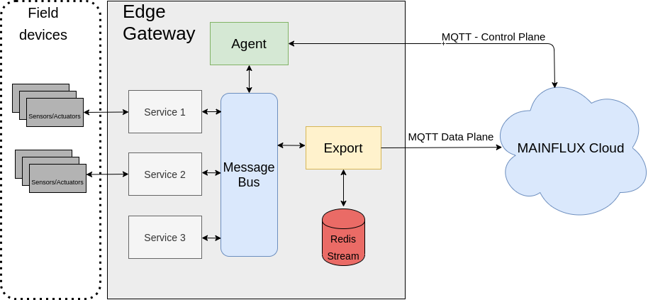

## Edge 

Mainflux IoT platform provides services for supporting management of devices on the edge. Typically, IoT solution includes devices (sensors/actuators) deployed in far edge and connected through some proxy gateway. 
Although most devices could be connected to the Mainflux directly, using gateways decentralizes system, decreases load on the cloud and makes setup less difficult. Also, gateways can provide additional data processing, filtering and storage.

Services that can be used on gateway to enable data and control plane for edge:

* [Agent][agent.md]
* [Export][export.md]
* [Mainflux][architecture.md]

Figure shows edge gateway that is running Agent, Export and minimal deployment of Mainflux services.
Mainflux services enable device management and MQTT protocol, NATS being a central message bus in Mainflux becomes also central message bus for other services like `Agent` and `Export` as well as for any new custom developed service that can be built to interface with devices with any of hardware supported interfaces on the gateway, those services would publish data to NATS where `Export` service can pick them up and send to cloud.

Agent can be used to control deployed services as well as to monitor their liveliness through subcribing to `heartbeat` NATS subject where services should publish their liveliness status, like `Export` service does.

[agent]: (https://github.com/mainflux/docs/blob/master/docs/agent.md)
[export]: (https://github.com/mainflux/docs/blob/master/docs/export.md)
